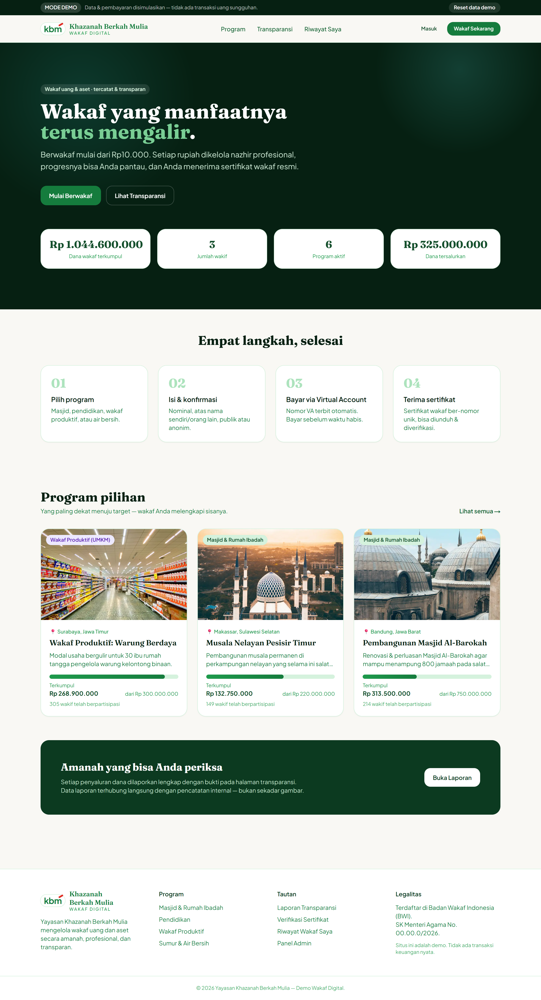
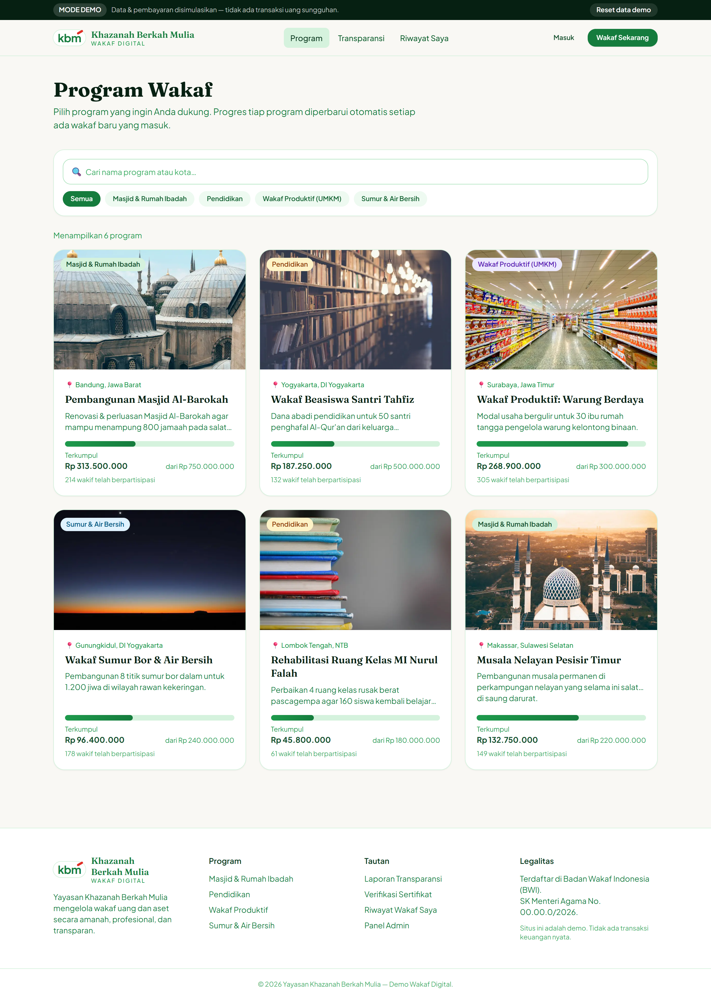
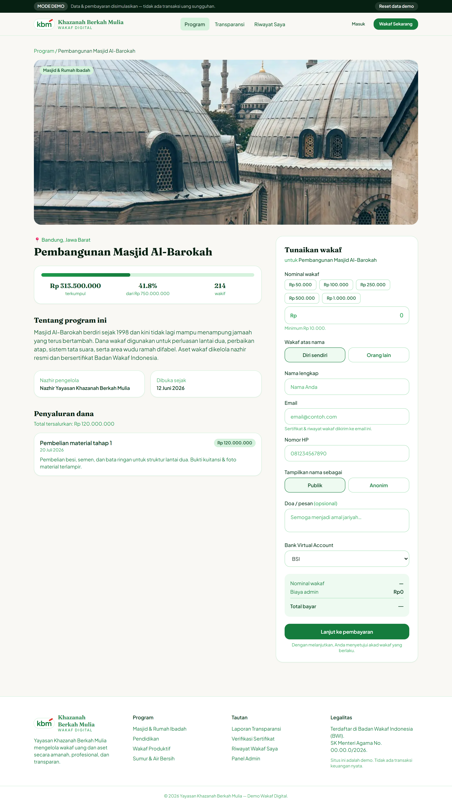
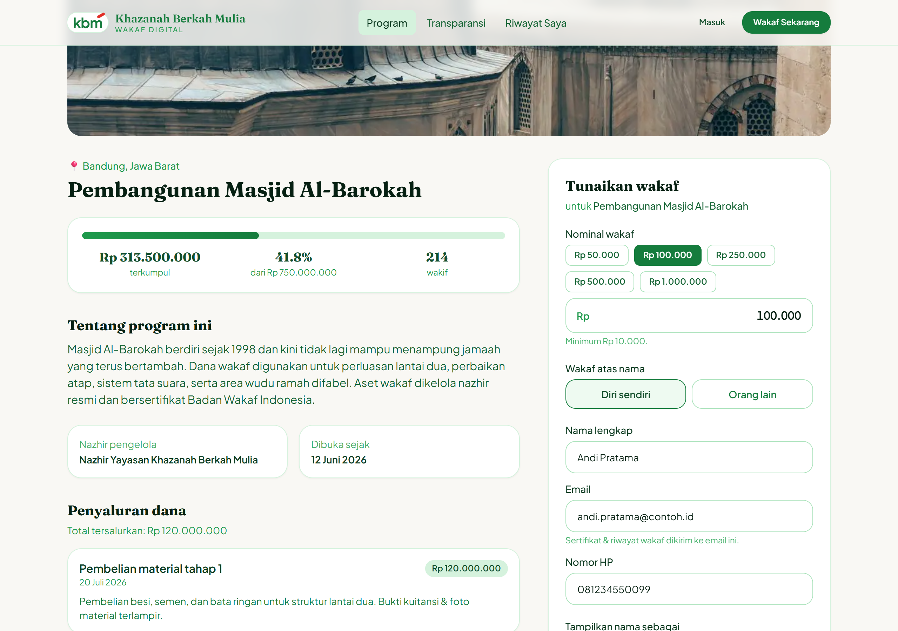
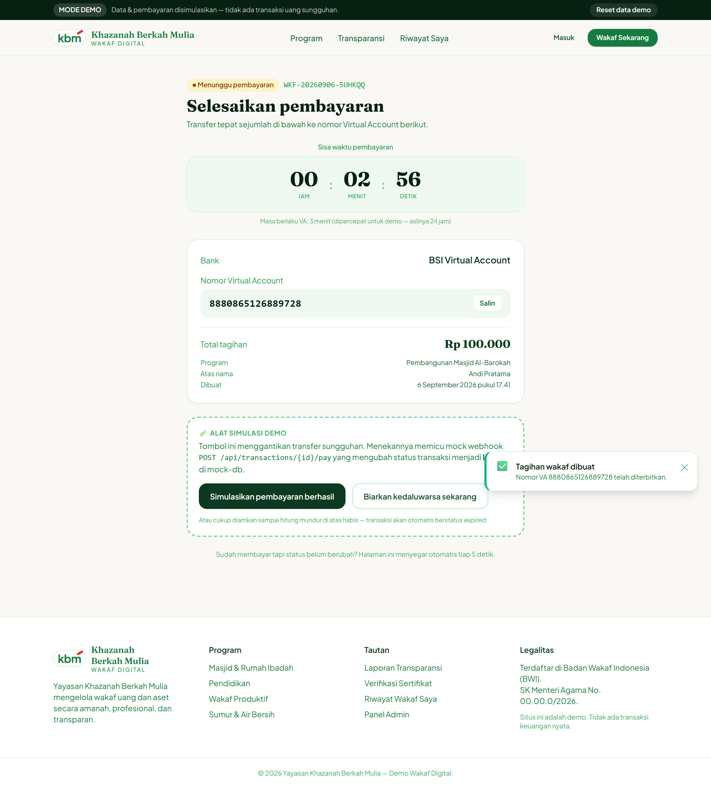
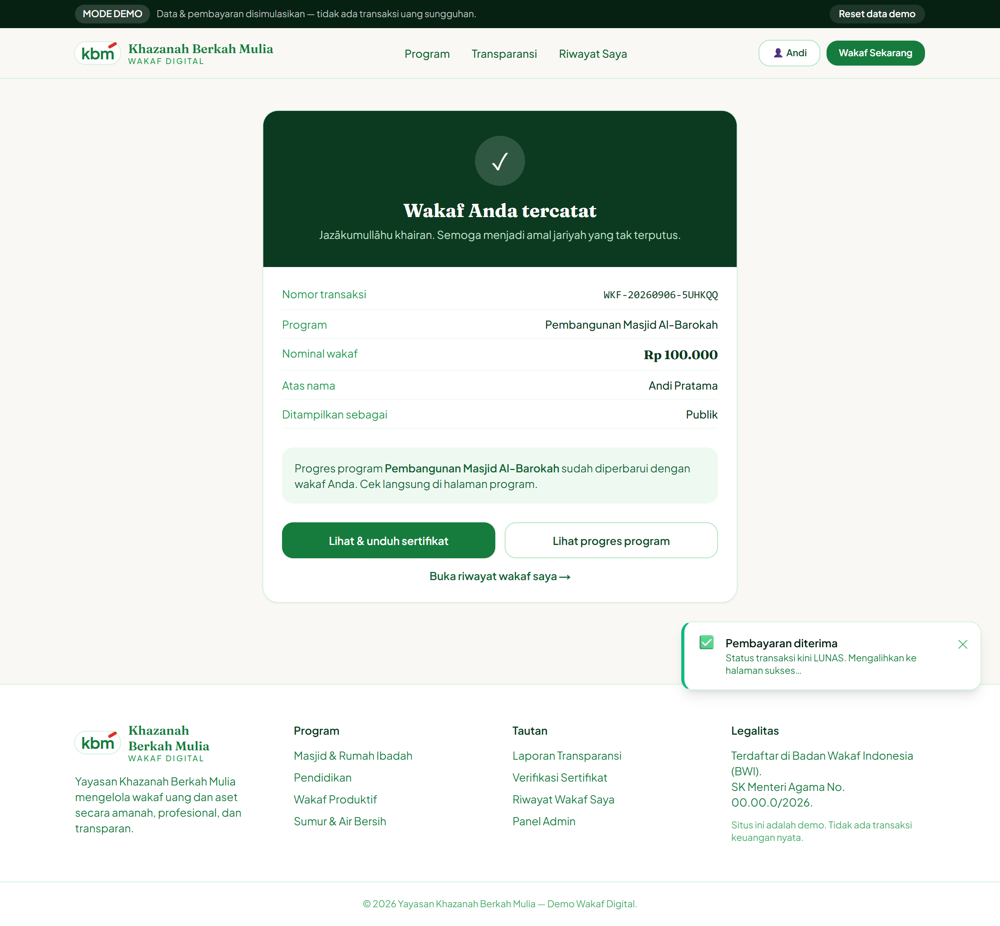
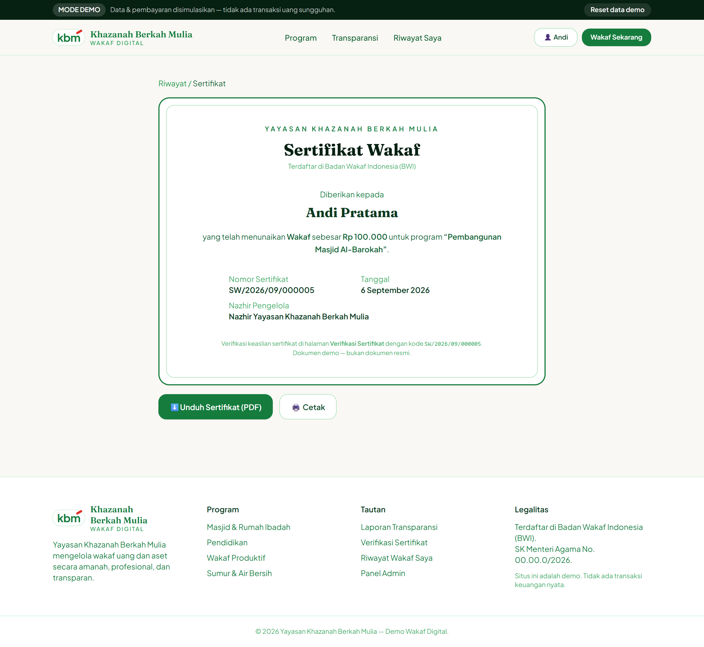
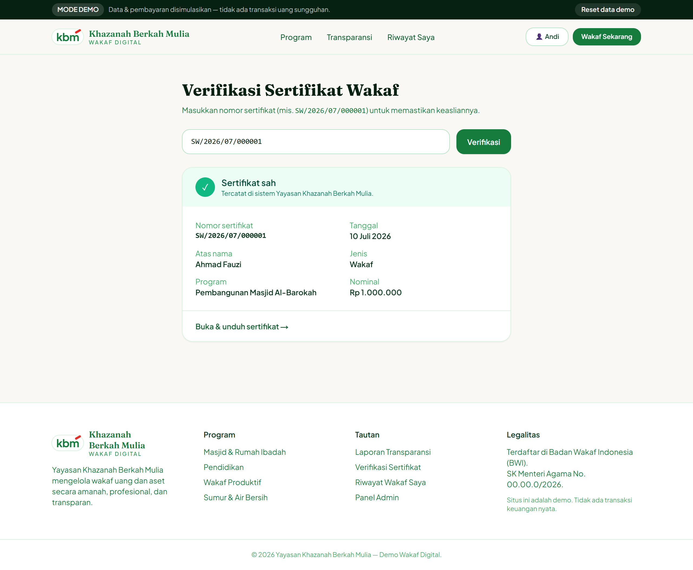
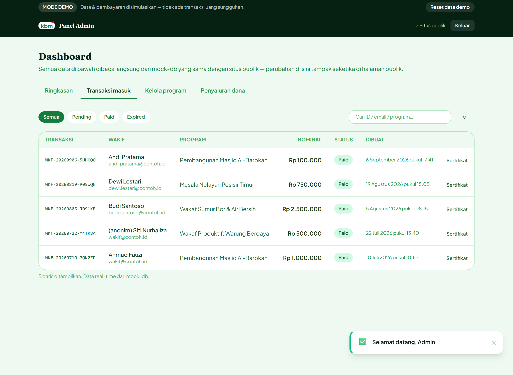
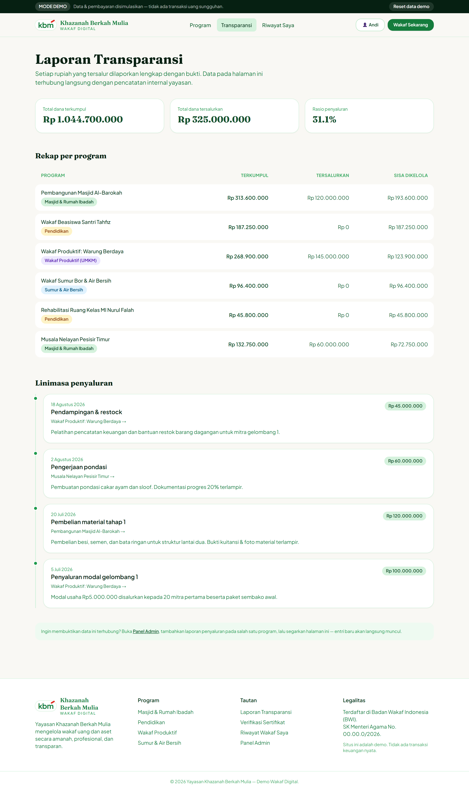

# Wakaf Digital — Demo Interaktif (Yayasan Khazanah Berkah Mulia / KBM)

Demo web wakaf digital yang **sepenuhnya bisa dicoba end-to-end** memakai mock
backend (in-memory store di sisi server + API routes). Tidak ada database
sungguhan dan tidak ada payment gateway asli.

## Menjalankan

```bash
npm install
npm run dev
# buka http://localhost:3000
```

Build produksi:

```bash
npm run build && npm start
```

## Kredensial & kode demo

| Peran | Cara masuk |
| --- | --- |
| **Admin** | `/admin` → `admin@kbm.or.id` / `admin123` |
| **Wakif** | `/riwayat` → email apa pun + OTP **`123456`** (selalu diterima). Pakai `wakif@contoh.id` untuk melihat riwayat contoh. |

## Alur yang bisa dicoba

1. **Browse & filter** — `/program`: 6 program, filter kategori + pencarian kata kunci.
2. **Flow wakaf penuh** — buka satu program → isi form (validasi jalan) → terbit
   transaksi + nomor Virtual Account mock (`88808…`).
3. **Menunggu pembayaran** — `/wakaf/[id]`: countdown mundur **benar-benar jalan**.
   - Tombol **"Simulasikan pembayaran berhasil"** → memicu mock webhook
     `POST /api/transactions/[id]/pay` → status `paid` → redirect ke halaman sukses.
   - Tombol **"Biarkan kedaluwarsa"** atau tunggu countdown habis → status `expired`
     + halaman retry.
4. **Update real-time** — setelah pembayaran mock sukses, progress bar & jumlah
   wakif di halaman program dan counter di beranda ikut bertambah (baca dari
   mock-db yang sama).
5. **Sertifikat** — `/sertifikat/[nomor]`: nomor unik, print-friendly, tombol
   **Unduh PDF** (jsPDF) + **Cetak**. Bisa diverifikasi di `/verifikasi`.
6. **Riwayat wakif** — `/riwayat`: login mock (email + OTP `123456`), daftar
   transaksi by email, lihat & unduh ulang sertifikat.
7. **Admin panel** — `/admin/dashboard`:
   - Daftar semua transaksi (real-time).
   - Tambah program baru → langsung muncul di listing publik.
   - Catat penyaluran dana per program + unggah bukti (mock file upload,
     preview gambar).
8. **Transparansi** — `/transparansi`: laporan penyaluran yang datanya berasal
   dari input admin panel. Tambah laporan di admin → refresh halaman ini →
   entri baru muncul.

**Reset data demo**: tombol di banner atas setiap halaman, atau
`POST /api/reset`. Mengembalikan mock-db ke kondisi seed.

## Tangkapan Layar

Alur wakaf → sertifikat, ditangkap otomatis oleh
[`scripts/capture-screenshots.mjs`](scripts/capture-screenshots.mjs)
(`node scripts/capture-screenshots.mjs` saat server demo berjalan).

### 1. Beranda — counter global (dana terkumpul, jumlah wakif)


### 2. Daftar program + filter kategori & pencarian


### 3. Detail program + form wakaf


### 4. Form wakaf terisi (nominal, data diri, atas nama, publik/anonim)


### 5. Menunggu pembayaran — countdown berjalan + Virtual Account mock
Tombol **"Simulasikan pembayaran berhasil"** ditandai jelas sebagai alat demo.


### 6. Pembayaran sukses — wakif otomatis dikenali


### 7. Sertifikat wakaf — nomor unik, tombol Unduh PDF & Cetak


### 8. Progres program ikut bertambah setelah pembayaran mock
Rp 313.500.000 → **Rp 313.600.000**, 214 → **215 wakif** (baca dari mock-db yang sama).


### 9. Verifikasi keaslian sertifikat


### 10. Panel admin — daftar transaksi real-time (transaksi baru muncul di atas)


### 11. Halaman transparansi — data dari input penyaluran admin


## Arsitektur

```
app/(pages)            Halaman publik + area /admin (layout & guard terpisah)
app/api/...            Mock backend — tiap route menunda 500–1500ms (lib/api/server.ts)
components/            Komponen UI, dipecah per fungsi (+ components/admin/*, components/home/*)
lib/mock-db/           In-memory store server-side + data seed
lib/api/client.ts      Wrapper fetch tunggal untuk semua komponen
lib/store/             Zustand: sesi login (persist localStorage) & toast
lib/config.ts          SEMUA nilai yang dipercepat/dipalsukan untuk demo
types/                 Tipe domain bersama; ada field `program_type` (wakaf | zakat | donasi | qurban)
```

### Modular untuk pengembangan lanjutan

`program_type` sudah disiapkan di tipe `Program`, `Transaction`, `Certificate`,
dan bisa dipilih saat admin membuat program. Menambah zakat/donasi/qurban tidak
perlu mengubah struktur inti.

## Bagian yang disederhanakan untuk demo (ganti saat produksi)

Semua ditandai komentar di kode. Ringkasnya:

| Lokasi | Disederhanakan | Untuk produksi |
| --- | --- | --- |
| `lib/config.ts` → `VA_TTL_MS` | Masa berlaku VA **3 menit** | Kembalikan ke 24 jam |
| `lib/api/server.ts` → `mockLatency()` | Delay 500–1500ms tiap request | Hapus |
| `lib/mock-db/` | Store di memori proses | Database sungguhan (Prisma/Drizzle) |
| `app/api/transactions/[id]/pay` | Webhook dipicu tombol | Callback + verifikasi signature dari payment gateway |
| `app/api/transactions/[id]/expire` | Expiry di-set dari browser | Job terjadwal / callback gateway |
| `app/api/auth/*` | 1 akun admin hardcode; OTP wakif selalu `123456` | User store + hash + sesi ber-token + OTP asli |
| `components/mock-file-input.tsx` | File dibaca jadi data URL di browser | Upload ke object storage, simpan URL |
| `components/brand-logo.tsx` | Wordmark "kbm" dibuat via CSS | Ganti dengan file SVG/PNG logo resmi |

## Catatan

- Semua teks Bahasa Indonesia. Mobile-first / responsif.
- `reactStrictMode: false` (`next.config.js`) agar interval countdown demo tidak
  double-fire di dev.
- Gambar program memakai Unsplash (lihat `next.config.js` → `remotePatterns`).
